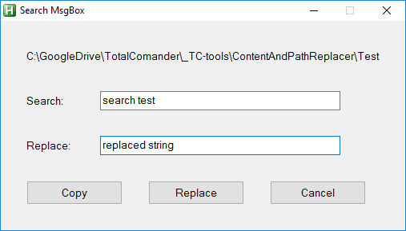

# Content and path replacer  
 * Search and replace string in files contents, file & folder names  
 * Search is proceded down from current directory  

### Features  
  String is searched & replaced in following formats:  
 *        "lower case"  
 *        "Title Case"  
 *        "kebab-case"  
 *        "snake_case"  
 *        "PascalCase"  
 *        "camelCase"  

### Parameters  
@param [ __$selected_file_or_folder__ ]  Pass path for prefill of form  


### Example  
  
  